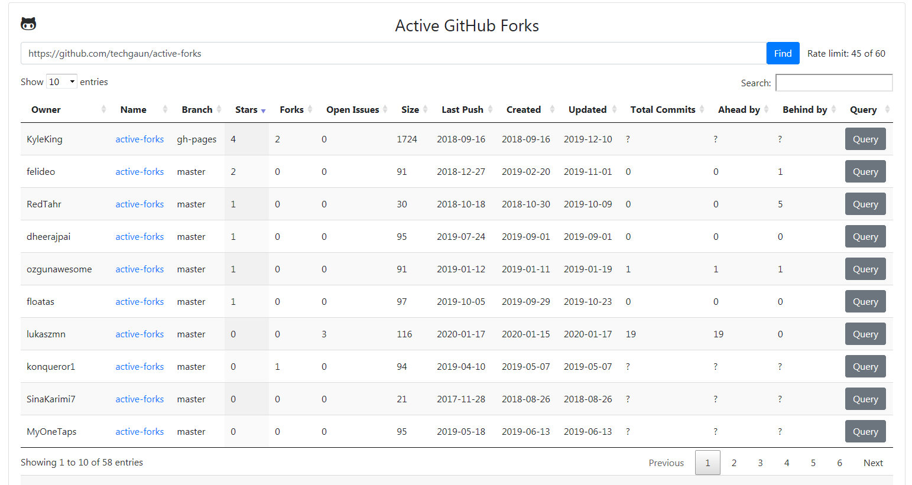

# active-forks

> Find the active github forks of a project

This project allows you to find the most active forks of a repository.

Each fork can additionally be queried to retrieve Ahead By and Behind By counts. GitHub [rate limits](https://developer.github.com/v3/rate_limit/) may apply.

Originally from [Find Active Fork](https://techgaun.github.io/active-forks/index.html)

See also [Active GitHub Forks](https://kyleking.me/active-forks/) ([source](https://github.com/KyleKing/active-forks))

